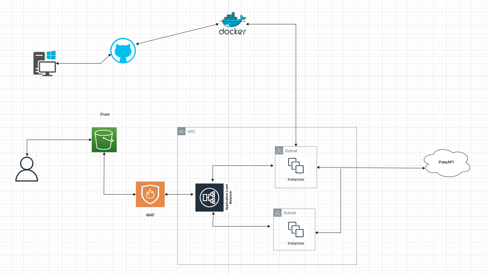

# 🐱‍🏍 PokéAPI REST Consumer

Este proyecto es una API REST desarrollada con **Spring Boot 3.4.4** y **Java 17** que consume la [PokéAPI](https://pokeapi.co/). Permite obtener información básica de los Pokémon como imagen, nombre, ID, tipo y habilidades. Además, implementa cacheo inteligente para mejorar el rendimiento en las consultas repetidas.

---
## Requisitos Previos

- **Java 17**
- **Spring Boot 3.2.5**
- **Maven**
- **Docker (opcional para el despliegue en contenedor)**

## Arquitectura y Stack Tecnológico

### Tecnologías Utilizadas:


---

## Endpoints
- 🔹 **Obtener Pokémon paginados**
  - **URL:** `/pokemon?offset=0&limit=10`
  - **Método:** `GET`
  - **Descripción:** Obtiene una lista de Pokémon paginados.

- 🔹 **Obtener Pokémon por Id o Nombre**
  - **URL:** `/pokemon/{idOrName}`
  - **Método:** `GET`
  - **Descripción:** Obtiene información detallada de un Pokémon por su ID o nombre.
---
## 🔍 Spring Boot Actuator Endpoints

- 🔹 **Health Check**
  - **URL:** `/actuator/health`
  - **Método:** `GET`
  - **Descripción:** Verifica el estado de salud de la aplicación

- 🔹 **Métricas**
  - **URL:** `/actuator/metrics`
  - **Método:** `GET`
  - **Descripción:** Proporciona métricas detalladas de la aplicación

- 🔹 **Info**
  - **URL:** `/actuator/info`
  - **Método:** `GET`
  - **Descripción:** Muestra información general de la aplicación

Los endpoints de Actuator proporcionan:
- Monitoreo en tiempo real
- Métricas de rendimiento
- Estado de salud del sistema
- Información sobre caché
- Detalles de configuración

Para acceder a todos los endpoints disponibles, visita: `/actuator`

---

## 🚀 Características

- 🔁 **Cache Inteligente**:
    - Consulta primero en caché.
    - Si no encuentra, realiza la petición a PokéAPI y almacena el resultado.
    - Si se cambia el `limit` en la paginación, la caché se limpia automáticamente.

- 📄 **Paginación configurable**:
    - Valor por defecto: `10`.
    - Se puede personalizar el `limit` de Pokémon por página.

- 🔍 **Búsqueda por ID o Nombre**:
    - El endpoint valida el dato recibido (si es un número o string).
    - Realiza la búsqueda correspondiente en PokéAPI.

- 📦 **Documentación Swagger** disponible para testear fácilmente los endpoints.

---

## 📸 Ejemplo de reques y  response endpoint /pokemon
```bash
curl --location 'http://tetst-1574460261.us-east-1.elb.amazonaws.com/api/v1/pokemon'
```
```json
{
    "count": 1302,
    "next": "offset=12&limit=12",
    "previous": null,
    "results": [
        {
            "id": 1,
            "name": "bulbasaur",
            "image_url": "https://raw.githubusercontent.com/PokeAPI/sprites/master/sprites/pokemon/1.png",
            "weight": 69,
            "type": [
                "grass",
                "poison"
            ],
            "abilities": [
                "overgrow",
                "chlorophyll"
            ]
        }
    ]
}
```
## 📸 Ejemplo de reques y response endpoint /pokemon/id|name
```bash
curl --location 'http://tetst-1574460261.us-east-1.elb.amazonaws.com/api/v1/pokemon/1'
```
```bash
curl --location 'http://tetst-1574460261.us-east-1.elb.amazonaws.com/api/v1/pokemon/bulbasaur'
```

```json
{
 "id":1,
  "name":"bulbasaur",
  "weight":69,
  "image":"https://raw.githubusercontent.com/PokeAPI/sprites/master/sprites/pokemon/1.png",
  "type":["grass","poison"],
  "abilities":["overgrow","chlorophyll"],
  "description": "A strange seed was planted on its back at birth.\fThe plant sprouts and grows with this POKéMON.A strange seed was       planted on its back at birth.\fThe plant sprouts and grows with this POKéMON.It can go for days without eating a single               morsel.\fIn the bulb on its back, it stores energy.The seed on its back is filled with nutrients.\fThe seed grows steadily            larger as its body grows.It carries a seed on its back right from birth. As it\fgrows older, the seed also grows larger.While it      is young, it uses the nutrients that are\fstored in the seeds on its back in order to grow.BULBASAUR can be seen napping in           bright sunlight. There is a seed on its back.\fBy soaking up the sun’s rays, the seed grows progressively larger.BULBASAUR can        be seen napping in bright sunlight. There is a seed on its back.\fBy soaking up the sun’s rays, the seed grows progressively          larger.BULBASAUR can be seen napping in bright sunlight. There is a seed on its back. By soaking up the sun’s rays, the seed          grows progressively larger.There is a plant seed on its back right from the day this POKéMON is born. The seed slowly grows           larger.A strange seed was planted on its back at birth. The plant sprouts and grows with this POKéMON.For some time after its         birth, it grows by gaining nourishment from the seed on its back.For some time after its birth, it grows by gaining nourishment       from the seed on its back.For some time after its birth, it grows by gaining nourishment from the seed on its back.The seed on        its back is filled with nutrients. The seed grows steadily larger as its body grows.It carries a seed on its back right from          birth. As it grows older, the seed also grows larger.For some time after its birth, it grows by gaining nourishment from the seed on its back.For some time after its birth, it grows by gaining nourishment from the seed on its back.For some time after its     birth, it grows by gaining nourishment from the seed on its back.For some time after its birth, it grows by gaining nourishment       from the seed on its back.A strange seed was planted on its back at birth. The plant sprouts and grows with this Pokémon.For some     time after its birth, it grows by gaining nourishment from the seed on its back.Bulbasaur can be seen napping in bright sunlight.     There is a seed on its back. By soaking up the sun’s rays, the seed grows progressively larger.Bulbasaur can be seen napping in       bright sunlight. There is a seed on its back. By soaking up the sun’s rays, the seed grows progressively larger.It can go for         days without eating a single morsel. In the bulb on its back, it stores energy.It can go for days without eating a single morsel.     In the bulb on its back, it stores energy.There is a plant seed on its back right from the day this Pokémon is born. The seed         slowly grows larger.While it is young, it uses the nutrients that are stored in the seed on its back in order to grow.",
  "evolutions":["ivysaur","venusaur"]
}
```
## 📸 Diagrama de arquitectura AWS propuesta

- **Seguridad**: Implementación de AWS WAF para proteger contra ataques comunes.
- **Alta Disponibilidad y Escalabilidad**: Uso de Autoscaling Groups y ALB para garantizar la disponibilidad del servicio y su capacidad para escalar según la demanda.
- **Hosting**: Implementacion de S3 para hostear Front, propuest de solucion, no implementado en el proyecto temporalmente
- **GitHub Actions**: Se implementa proceso de GitHub Actions que ejecuta el proceso de construccion del proyecto y genera la imagen docker para posteriormente subirla a docker hub e implementarla en las instancias.

  
  
